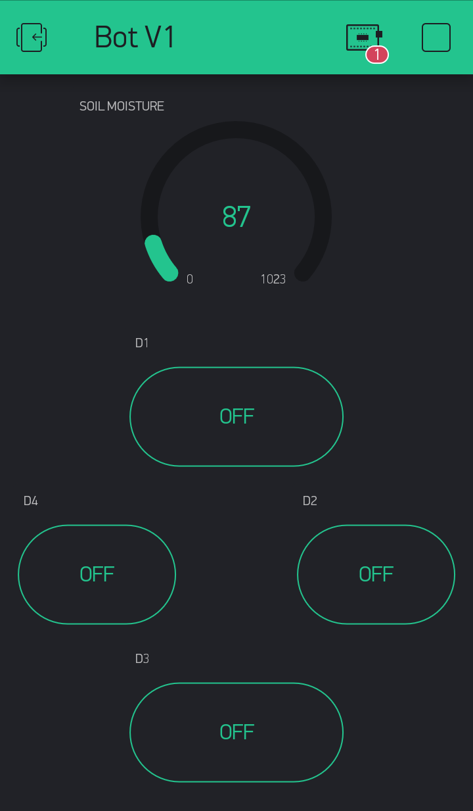
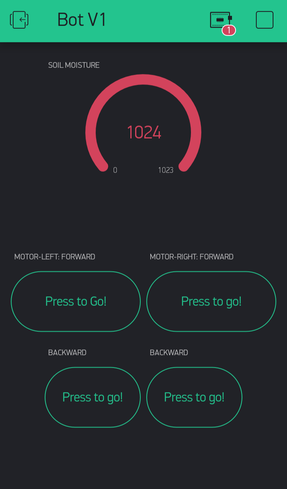

# FarmConnect

FarmConnect is an integrated platform which helps farmers to monitor their farms and get experts advice on how to increase the yield of their crops. 

### The platform has 2 major components-

1. The Robot - which is deployed on the field to monitor different soil characterstics like moisture and environmental conditions like the temperature and humidity. The data collected by the bot will be stored in a server which can be accessed by farmers using their registered account on the web/mobile platform.

2. The App/Web platform - is an interface for users to access their farm's soil conditions and share that data with experts in order to seek advice on which crops will give maximum yield. 

The FarmConnect Bot (Prototype v1.0).

A fully-functional bot which captures soil data, monitors environmental conditions and send it to the Blynk server. The bot uses Arduino and NodeMCU as the hardware platform and Blynk App for controlling the bot and monitoring sensor data.

# Getting Started

Download latest Blynk library here:
    https://github.com/blynkkk/blynk-library/releases/latest
  
  Blynk is a platform with iOS and Android apps to control
  Arduino, Raspberry Pi and the likes over the Internet.
  You can easily build graphic interfaces for all your
  projects by simply dragging and dropping widgets.

    Downloads, docs, tutorials: http://www.blynk.cc
    Sketch generator:           http://examples.blynk.cc
    Blynk community:            http://community.blynk.cc
    Follow us:                  http://www.fb.com/blynkapp
                                http://twitter.com/blynk_app

  Blynk library is licensed under MIT license
  This example code is in public domain.

  Note: This requires ESP8266 support package:
    https://github.com/esp8266/Arduino

  Please be sure to select the right NodeMCU module
  in the Tools -> Board menu!

  Change WiFi ssid, pass, and Blynk auth token to run :)
  Feel free to apply it to any other example. It's simple!
  
  # Blynk App
  
  ## Onboard Sensor Data
  
  
  
  
  ## Controls for Manual Bot Movement
  
   
  
  

